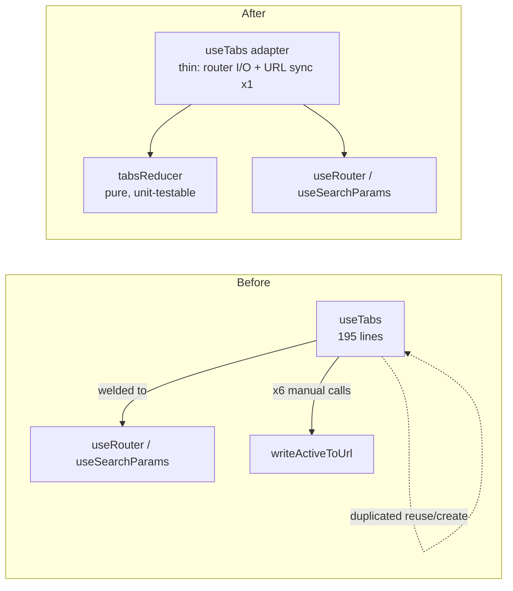
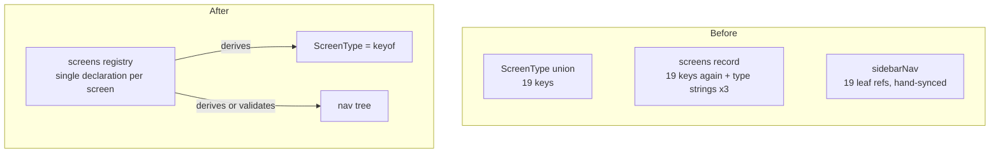

# Architecture Review — Deepening Opportunities

_Read-only audit, 2026-07-16. Produced by `/improve-codebase-architecture`. No code was changed._

---

## ✅ Implementation status (2026-07-16) — all candidates done

Every candidate below has been implemented. Summary:

| # | Candidate | Status | Key artifacts |
|---|---|---|---|
| — | **Test infrastructure** | ✅ | `vitest` added; `vitest.config.ts`; `test` / `test:watch` scripts. **37 unit tests, all green.** |
| 1 | Pure tab reducer | ✅ | New `lib/tabs-reducer.ts` (pure); `hooks/use-tabs.ts` is now a thin adapter with **one** loop-guarded URL-sync effect. `lib/tabs-reducer.test.ts` (16 tests). |
| 2 | Single-source registry + validated nav | ✅ | `ScreenType = keyof typeof screenDefs` (union + third key-restatement gone; `type` injected from the key). Nav moved to new `lib/nav.tsx`. `findNavIssues` machine-checks registry↔nav in `lib/nav.test.ts`. |
| 3 | Pure list pipeline | ✅ | New `lib/list-rows.ts` (`matches`/`compare`/`deriveRows`/`cycleSort`). `ListScreen` reads one `visibleRows` value — the `filtered`/`sorted` split is closed. `lib/list-rows.test.ts` (16 tests). |
| 4 | Unified nav renderer | ✅ | `components/nav-main.tsx` is now one depth-parameterized `NavNode`; single link construction; named-`children` anti-pattern removed. |
| 5 | One screen-header source | ✅ | New `components/dashboard/screen-header.tsx`; `ListScreenConfig` drops `title`/`description`; both screen kinds render `ScreenHeader`. |
| 6 | Fixtures / height / empty-states | ✅ | Fixtures unified in `lib/fixtures.tsx` (was `lib/sample-data.ts` + inline sidebar literals). Tab-bar height shared via `TAB_BAR_ROW`. The two empty states were kept — different regions/copy, per the note below. |

**Verification**: `pnpm typecheck`, `pnpm build`, and `pnpm test` (37 passing) all green; behavior confirmed in-browser (reconcile-on-load, client nav, tab switch, close-with-neighbor-focus + URL sync with no render loop, list sort/filter/count). The two pre-existing lint errors (`components/header-search.tsx`, `hooks/use-mobile.ts`) are unrelated and untouched.

The original audit is preserved verbatim below.

---

**Goal**: surface refactors that turn **shallow modules** (interface nearly as complex as the implementation) into **deep** ones, improving testability and AI-navigability. Vocabulary: _module, interface, depth, seam, adapter, leverage, locality, deletion test_.

**Scope**: weighted toward the git-history hot spots — the tabbed workspace (`useTabs`, tab bar, screen registry), the registry-driven `ListScreen`, and the sidebar nav tree.

---

## Context

- One real route (`/dashboard`); "screens" are registry entries rendered inside a single client workspace, addressed by `?tab=<screenType>`.
- App state lives in: URL search params (`?tab=`), React local state (tabs, filters, sort), and `next-themes` localStorage. No global store.
- **Zero tests and zero test infrastructure.** No `test` script, no vitest/jest config, no `*.test.*` files. Every candidate below is judged partly on whether it creates a testable seam.
- No `CONTEXT.md` or ADRs exist yet; nothing constrains these suggestions.

### Testability scorecard (today)

| Module | Logic worth testing | Testable without a React render? |
|---|---|---|
| `hooks/use-tabs.ts` | tab algebra: open/reuse, close-neighbor, duplicate, URL reconcile | **No** — welded to the Next router |
| `components/dashboard/list-screen.tsx` | `matches`/`compare` (pure); sort-cycle + filter pipeline (embedded) | Partly — the two helpers yes; the pipeline no |
| `lib/screens.tsx` | `getScreen` lookup; registry ↔ nav consistency | `getScreen` yes; registry↔nav sync is **unverified by anything** |
| `components/nav-main.tsx` | recursion over `NavEntry` | Only via render |
| `components/theme-provider.tsx` | `isTypingTarget` hotkey guard | Pure but unexported |

---

## Candidate 1 — Extract a pure tab reducer out of `useTabs`

**Recommendation strength: `Strong`**

**Files**: `hooks/use-tabs.ts`

**Problem** — `useTabs` (~195 lines) is the most logic-dense module in the repo, and none of its logic is reachable without rendering React inside a Next router context:

- The tab algebra (open-or-reuse, close-with-neighbor-focus, duplicate-insert-after-source, close-others, close-all) is interleaved with `useRouter`/`usePathname`/`useSearchParams` I/O.
- The "reuse existing tab of this screenType, else create" branch is implemented **twice**: once in the render-phase URL reconciler (`use-tabs.ts:96-104`) and again in `openTab` (`use-tabs.ts:110-117`).
- The URL side-effect is not derived from state — `writeActiveToUrl(...)` is manually re-fired from **six** mutators (`use-tabs.ts:118, 128, 144, 163, 174, 182`). Any new mutator must remember to sync the URL; forgetting is a silent bug. (Finding: the seam between "which tab is active" and "what's in `?tab=`" is smeared across the whole hook instead of expressed once.)

**Solution** — split the module along its natural seam: a pure reducer (`(state, action) → state`, plain data in/out, no React) plus a thin hook **adapter** that owns the router I/O and derives the URL write from state transitions in one place. The hook's public interface (`TabsApi`) stays identical — no consumer changes.

**Benefits**
- **Locality**: all tab algebra in one pure function; the reuse-vs-create logic exists once instead of twice; the URL sync exists once instead of six times.
- **Leverage**: the reducer becomes the repo's first unit-testable module — neighbor-focus on close, duplicate insertion order, and URL reconciliation each become 3-line table tests. This is where real regressions would hide (the neighbor-focus logic at `use-tabs.ts:141-144` is exactly the kind of off-by-one that ships silently).
- **The interface is the test surface**: today the interface is "a hook you can only call under a router provider"; after, it's "a function".

**Before / after**



---

## Candidate 2 — Collapse the triple-declared registry and derive the nav tree from it

**Recommendation strength: `Strong`**

**Files**: `lib/screens.tsx`, `components/nav-main.tsx` (consumer only)

**Problem** — `lib/screens.tsx` is a shallow, high-fan-in "god registry":

1. The `ScreenType` union (`screens.tsx:42-60`) enumerates all 19 keys; the record type `Record<ScreenType, Screen>` enumerates them again; and each builder call passes the same string a **third** time as its first argument (`screen("dashboard", ...)` under the key `dashboard:`). The interface (the literal keys) is as large as the implementation — the classic shallow-module smell. Adding a screen means editing three places in this file plus the nav tree.
2. `screens` and `sidebarNav` (`screens.tsx:315-346`) are two parallel structures kept in sync by hand. Every nav leaf is `leaf(s.x)` — a hand-maintained restatement of registry membership. Nothing (no type, no test) guarantees every screen is reachable from the nav, or that one isn't listed twice.
3. The file also owns sidebar presentation concerns (grouping, ordering, group icons), coupling the registry to the sidebar across what should be a seam.

**Deletion test** — the `screen()`/`listScreen()` builders (`screens.tsx:105-138`) barely deepen anything: `screen()` spreads four args into an object; `listScreen()` copies `config.title/description` up into `label/description`. Deleting them would concentrate rather than scatter — a "yes" on the deletion test, i.e. they are shallow.

**Solution** — make the registry the single source of truth and let everything else derive:
- Derive `ScreenType` from the registry keys (`keyof typeof screens` via `satisfies`), eliminating the union and the third restatement of each key.
- Either derive `sidebarNav` leaves from the registry (registry entries declare their group/order) **or** keep the hand-authored tree but add a cheap consistency check (a pure function `unreachableScreens(screens, nav)` — trivially unit-testable, and could run as a type-level check or a test once test infra exists).
- Move the `NavEntry`/`sidebarNav` half next to `nav-main.tsx`, its only consumer, so the registry file stops knowing about sidebar presentation.

**Benefits**
- **Locality**: "add a screen" becomes a one-place edit. "Where is this screen in the nav?" has one answer.
- **Leverage**: the registry↔nav consistency — currently unverified by anything — becomes machine-checked.

**Before / after**



---

## Candidate 3 — Lift the `ListScreen` filter/sort pipeline into a pure module

**Recommendation strength: `Worth exploring`**

**Files**: `components/dashboard/list-screen.tsx`

**Problem** — `matches()` (`list-screen.tsx:57-62`) and `compare()` (`list-screen.tsx:64-71`) are already pure — good. But the orchestration is trapped inside the component:

- The filter → sort derivation (`list-screen.tsx:95-116`) and the sort-cycle state machine `unsorted → asc → desc → unsorted` (`toggleSort`, `list-screen.tsx:119-125`) live as `useMemo`/`useState` inside `ListScreen`. Testing "does clicking a header twice sort descending" or "does a whitespace-only filter pass through" requires a full component render.
- **Latent hazard**: the results count and empty-state check read `filtered` (`list-screen.tsx:147, 245`) while the rendered rows read `sorted` (`list-screen.tsx:255`). Consistent today only because `sorted` is a reordering of `filtered` — a future change (e.g. pagination, sort-time dedupe) breaks that invariant silently.

**Solution** — extract a pure `deriveRows(rows, columns, applied, sort) → visibleRows` (or a headless `useListRows` hook whose core is a pure function) plus the `toggleSort` cycle as a pure transition. `ListScreen` becomes a thin rendering adapter over it, and reads one value (`visibleRows`) for count, empty state, and body — closing the `filtered`/`sorted` split.

**Benefits**
- **Locality**: the whole "what rows do you see and in what order" question is answered by one function.
- **Leverage**: this pipeline is reused by every current and future list screen (customers, inventory, and the 17 placeholder screens that will grow tables) — deepening it once pays on each.
- Tests: table-driven tests over plain arrays; no render, no DOM.

**Before / after**

```
Before                                    After
──────                                    ─────
ListScreen (300+ lines)                   list-rows.ts (pure)
├─ matches() pure ✓                       ├─ matches / compare / deriveRows / cycleSort
├─ compare() pure ✓                       └─ (unit-tested, no React)
├─ filtered = useMemo(...)  ┐
├─ sorted   = useMemo(...)  ├─ trapped    ListScreen (thin adapter)
├─ toggleSort state machine ┘             └─ renders visibleRows only
└─ renders filtered AND sorted (split!)
```

---

## Candidate 4 — Unify the forked nav-tree rendering paths

**Recommendation strength: `Worth exploring`**

**Files**: `components/nav-main.tsx`

**Problem** — the recursive nav renderer forks into two near-identical code paths because the top level uses different sidebar primitives than nested levels:

- Leaf markup is written twice: top-level (`nav-main.tsx:43-51`, `SidebarMenuItem/Button`) and nested (`nav-main.tsx:105-116`, `SidebarMenuSubItem/SubButton`) — both build the same `/dashboard?tab=${screen.type}` link with icon + label.
- Group collapsibles likewise: `NavGroup` (`nav-main.tsx:65-97`) vs the group branch of `NavSubEntry` (`nav-main.tsx:119-142`), differing only in primitive choice and a class name.
- `NavGroup` receives JSX via a named `children` data prop (`nav-main.tsx:40`) rather than React children — an anti-pattern that confuses tooling.

Understanding one nav entry means reading two rendering paths — poor **locality** in the module whose whole job is uniform recursion.

**Solution** — a single recursive renderer parameterized by depth (or a tiny primitives-adapter: `{Item, Button}` chosen once per level), so leaf and group markup each exist once. This is a **hypothetical seam** today (one adapter); it becomes real only if a second consumer of the nav recursion appears — so keep the abstraction minimal.

**Benefits** — one place to change link construction (which matters if Candidate 2 changes how screens are addressed); the `NavEntry` recursion becomes actually uniform, matching its (genuinely deep) data model.

---

## Candidate 5 — One source of truth for a screen's title/description header

**Recommendation strength: `Worth exploring`** _(cheap; naturally folds into Candidate 2)_

**Files**: `lib/screens.tsx`, `components/dashboard/list-screen.tsx`

**Problem** — screen `label`/`description` are declared on every `Screen`, but for list screens they are also declared inside `ListScreenConfig.title/description` (`list-screen.tsx:45-48`), hoisted up by the `listScreen()` builder (`screens.tsx:132-133`), and then `Screen.description` is effectively dead for those screens because `ListScreen` renders its own `<h1>/<p>` header (`list-screen.tsx:143-144`) — near-identical markup to `ScreenPlaceholder`'s header (`screens.tsx:81-102`). Answering "where does this screen's title come from" requires bouncing across three files.

**Solution** — a single `ScreenHeader` rendered by the workspace (or by both screen kinds) fed from `Screen.label/description`; `ListScreenConfig` drops its duplicated `title/description`.

**Benefits** — **locality** (one declaration, one renderer); removes the dead-field trap; shrinks `listScreen()` toward passing the deletion test honestly.

---

## Candidate 6 — Consolidate fixtures and duplicate empty-states

**Recommendation strength: `Speculative`**

**Files**: `components/app-sidebar.tsx`, `lib/sample-data.ts`, `components/dashboard/tab-bar.tsx`, `components/dashboard/tab-workspace.tsx`

**Problem** — smaller scattered frictions:
- Mock data has two homes: `lib/sample-data.ts` (list rows) and inline literals in components (`app-sidebar.tsx:21-44` hard-codes `user`/`teams` with JSX icon nodes). No single fixtures seam — which will matter the moment a real data source appears.
- Two separate empty-state components for the same "no tabs" condition (`TabBarEmpty` at `tab-bar.tsx:172-178`, `EmptyState` at `tab-workspace.tsx:67-82`), rendered adjacently by the same parent.
- `TabWorkspaceFallback` (`tab-workspace.tsx:88-97`) hand-duplicates the tab bar's `h-10 border-b` sizing so the Suspense fallback matches (`tab-bar.tsx:43`) — a visual constant maintained in two places.

**Solution** — move all fixtures behind one `lib/fixtures` seam (a **hypothetical seam** for the future real data source — don't build the adapter until that source exists); share the tab-bar height token; keep the two empty states only if their copy intentionally differs.

**Benefits** — modest **locality** wins now; the fixtures seam is mostly about making the future "swap mock for real data" a one-module change. Speculative because YAGNI applies until a real backend is on the roadmap.

---

## What's already good (no action)

- **`ListScreen` is the best-isolated module in the codebase** — fully generic over `T`, imports nothing from tabs or the registry. The seam between data and table is clean; Candidate 3 deepens it without moving it.
- The `NavEntry` recursive model is genuinely deep (arbitrary nesting from a small interface) — the friction is in its duplicated leaves (Candidate 2) and forked renderer (Candidate 4), not the model.
- `useTabs`' render-phase URL reconciliation follows the documented React pattern and is commented with its rationale — the problem is testability, not correctness.

---

## Top recommendation

**Start with Candidate 1 (pure tab reducer).** It has the highest leverage-to-risk ratio:

- It targets the densest, most regression-prone logic in the repo (tab algebra + URL sync) while leaving the public `TabsApi` interface untouched — zero consumer churn.
- It removes two real hazards found in the audit: the duplicated reuse-vs-create branch and the six hand-fired URL writes.
- It creates the repo's **first unit-testable module**, which forces the (currently absent) test infrastructure into existence — after which Candidates 2 and 3 each arrive with their tests nearly free.

Candidate 2 is the close second and pairs well as a follow-up: it's the other `Strong`, and Candidates 4 and 5 both shrink as side effects of doing it.
